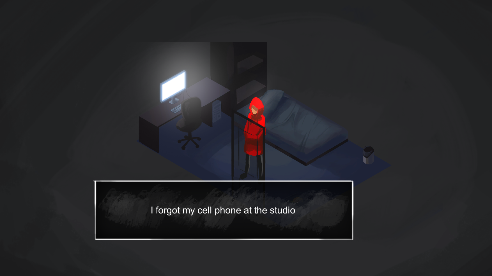

<h1 align="center">MALSON</h1>
<h3 align="center">GGJ 2019 game. What does home mean to you?</h3>

  In Malson, you play as a young person who feels alienated in their own home. Walk through the procedurally 
   
  generated house to get through each day. Each day lasts as long as the main music track. Use WASD
   
  to move and E to interact with doors and the different objectives. Headphones are strongly recommended.

 

  <a href="https://globalgamejam.org/2019/games/malson">
    
     
    Global Game Jam site with the executable
  </a>
 

 

<h3 align="center">Credits:</h3>

  Carlos Menéndez (Design, Programming) 
  Fen Nicolás (Design, Programming) 
  Andrés Olmedo (Design, Music) 
  Carlus Planells (Design, Production) 
  Aarón Rodríguez (Design, Art) 
    
  
  &emsp;&emsp;
  

